# Karing. Простая настройка на iPhone

1. Нужно установить [приложение](https://apps.apple.com/us/app/karing/id6472431552).

	Тут либо кнопка "Установить" с последующим вводом пароля/подтверждением по отпечатку пальца/лицу, либо, как на скриншоте, облачко.

	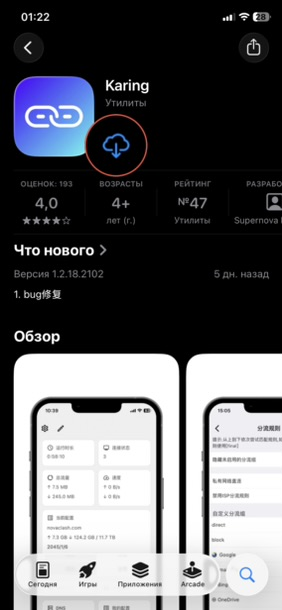

1. Запустить. Приложение будет спрашивать всякие глупости

	Одна большая кнопка, подсвечена, нажать.

	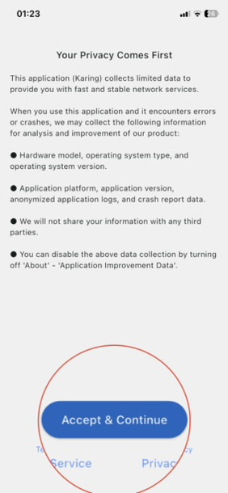

	Находим и выбираем "Русский", Next.

	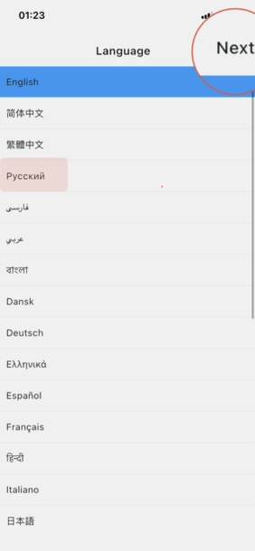

	Тут нужно найти "Российская Федерация", но можно просто нажать "Далее".

	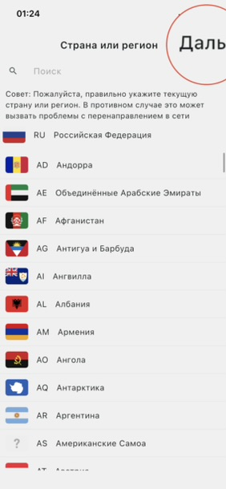

	Просто "Далее".

	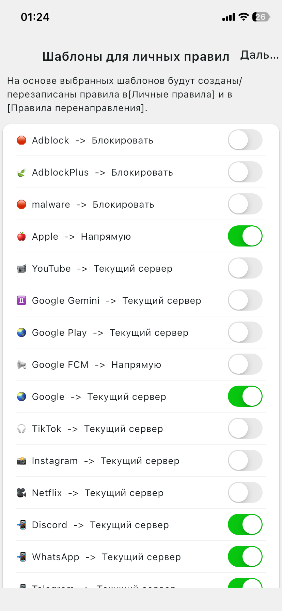

	Оставляем включеным "Режим новичка", жмем "Готово".

	

1. Ввод "ключа"

	Сама программа обеспечивает пропуск через себя ваших данных, отправку их в VPN, получение и обработку ответов. Но для того, чтоб VPN работал, нужен "ключ", длинная строка, начинающаяся на vless://..., vmess://..., trojan://..., ss://... Это сжатая информация о вашем сервере VPN, вашей на нем идентификации, шифровании. Ну и давайте без подробностей, тут оно нам не нужно. А нужно знать, что такая строка должна быть, ее вам должен выдать ваш VPN-провайдер (реальный провайдер, если вы сами покупаете услугу VPN, коллега, сын, внук). Получение ключа - момент ответственный, не используйте бесплатные ключи и/или ключи из непроверенных источников.

	**Не пересылайте ключи по SMS или используя российскиме мессенджеры или социальные сети.**

	Допустим, ключ нам прислали по iMessage или Telegram. Копируем его в буфер - нажимаем на сообщение и держим секунду-другую до появления контекстного меню. Копируем.

	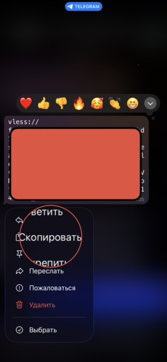

	Возвращаемся в Karing, там выбираем "Импорт из буфера обмена".

	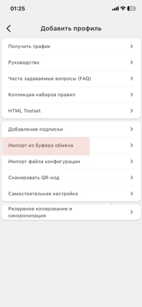

	Разрешаем вставку.

	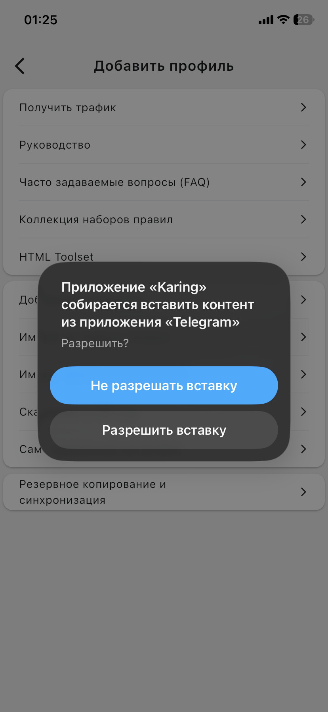

	Вводим произволное примечание, жмем галку.

	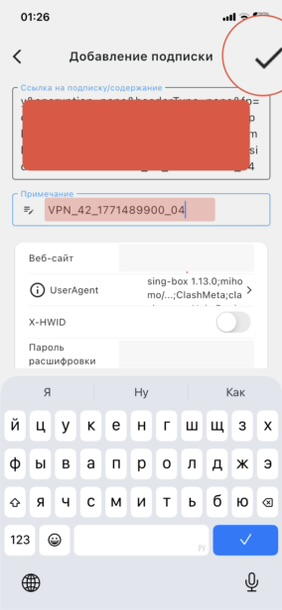

1. Первое подключение

	Не запомнил, программа сама попыталась установить первое соединение или я болшой красный знак внизу нажал. Но тут нужно "разрешить добавление конфигурации VPN"

	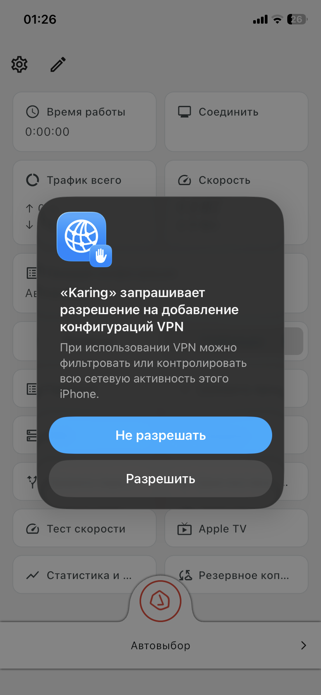

	и ввести свой обычный PIN-код, который вы вводите при включении смартфона.

	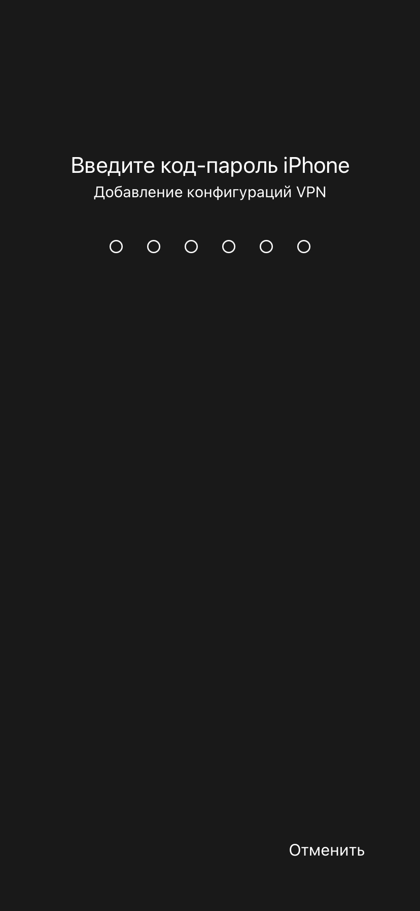

	С "Правила" нужно переключиться на "Глобально".

	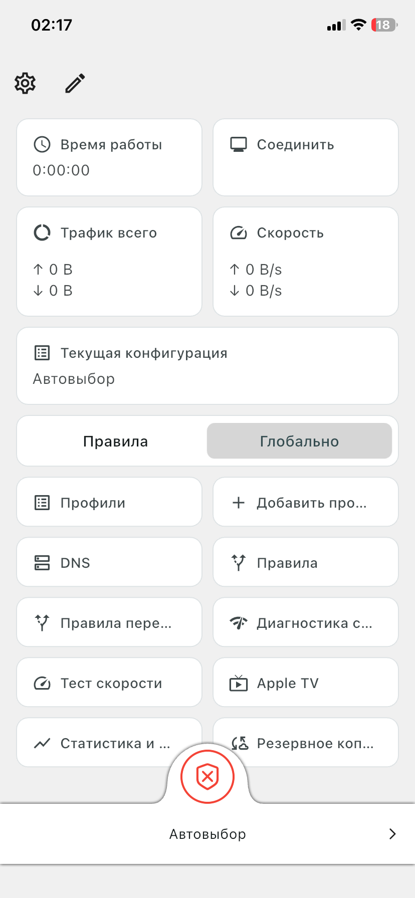

1. Вуаля!

	Если кнопка внизу зеленая - у нас работает все заблокированное, но не работает все "Своё". Нужно постоянно заходить в приложение и включать выключать. Если (а это почти очевидно) вас так не устраивает, смотрим дальше.

1. Автоматизация

	- добавляем две быстрые команды (переходите по ссылкам и нажимайте "Получить быструю команду"): [вкл впн](https://www.icloud.com/shortcuts/ac233cf92af54e43bba3ea398c24ab76), [выкл впн](https://www.icloud.com/shortcuts/e3849dd046d649ccb2bfba1f52e7d180).

	- ищем приложение "Команды"

	

	- в медиатеке, в разделе быстрых команд можно найти наши "вкл/выкл впн"

	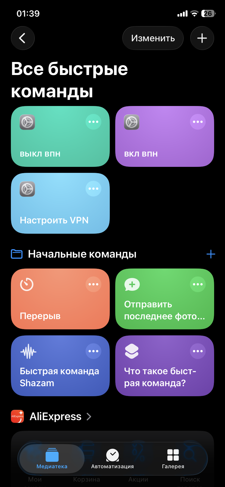

	- переходим в автоматизацию и жмем "+" в правом верхнем углу

	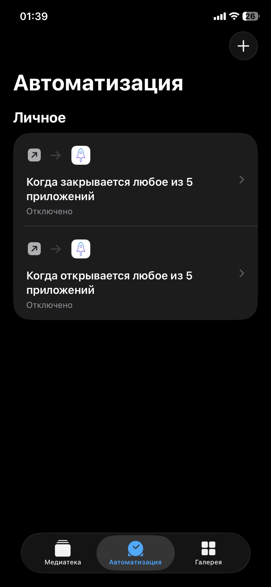

	- ищем "Приложение", жмем

	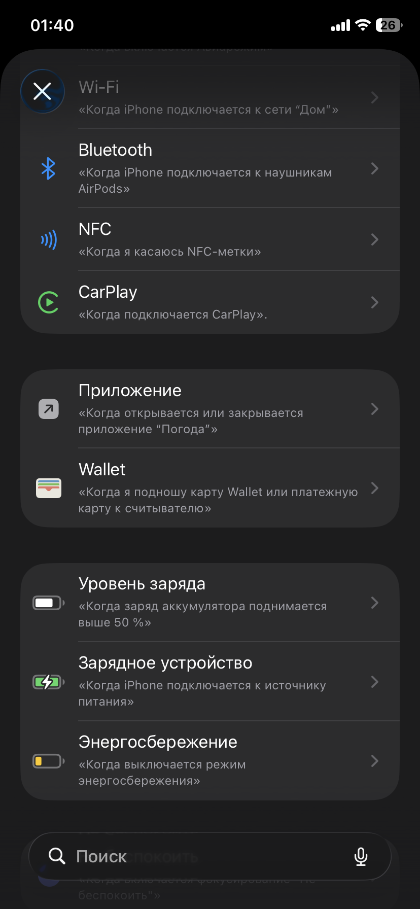

	- для первой автоматизации делаем все, как на экране, проваливаемся в строку "приложение" и выбираем все приложения, которые должны работать через VPN (небольшой список от меня: YouTube, X (Twitter), WhatsApp, ,Threads, Telegram, Speedtest, Instagram, Firefox или Firefox Focus, FaceTime), "Далее"

	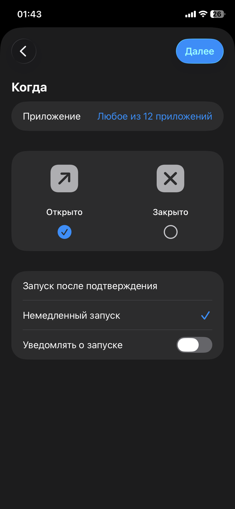

	- на следующем экране выбираем быструю команду "вкл впн"

	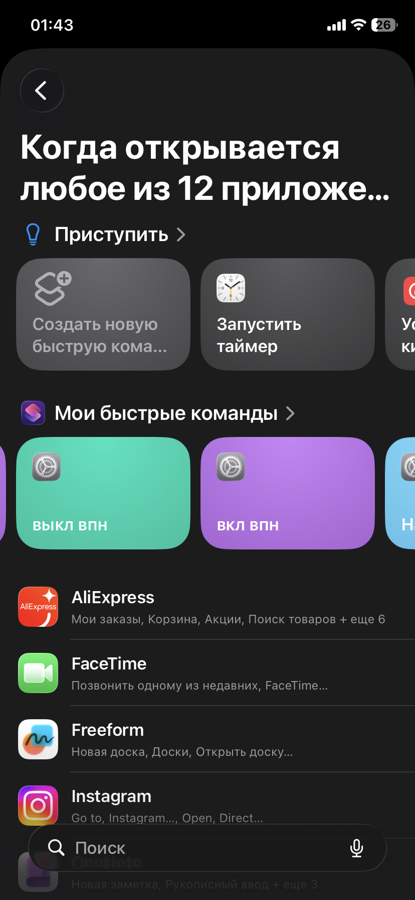

	- тут создание автоматизации обрывается, но у нас появилась строка с уже готовой.

	- нужно создать еще автоматизацию, также выбрать все приложения, выбранные для другой автоматизации, но тут нужно снять "точку" с "Открыто" на "Закрыто", а действие - "выкл впн"

### Теперь при запуске любого приложения из списка будет стартовать VPN, а при закрытии/сворачивании приложений - останавливаться.
